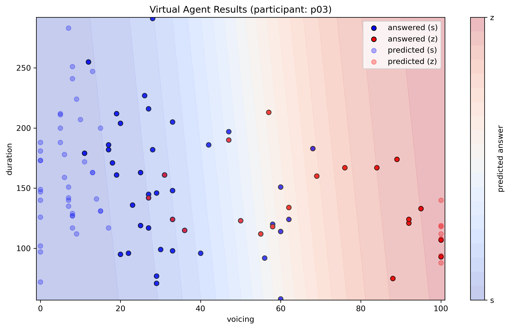

# AsTRiQue
#### **AS**k **T**he **RI**ght **QUE**stions: An active machine learning framework for perception experiments

AsTRiQue is a tool designed to streamline perception experiments that involve large amounts of stimuli. In traditional perception experiments, participants often have to classify a large number of items, which can be time-consuming and tiring. AsTRiQue minimizes this burden through active learning; a kind of machine learning where a model is continuously updated based on the participant’s input to decide what to ask next.

The experiment starts by randomly selecting a few stimuli for the participant ("oracle") to classify. Based on the answers, a logistic regression model is trained to predict how the participant might respond to all the remaining stimuli. Then, the model picks the stimulus it is most uncertain about (uncertainty sampling). By targeting these hard-to-predict cases, the model learns much faster.

To keep things balanced, there is also an option to occasionally include a very easy (high-certainty) stimulus as a “cleanser” to reduce participant fatigue from repetitive difficult stimuli.

This process repeats: the participant answers, the model updates, and a new uncertain stimulus is selected. Once the model is confident enough in its predictions of all the stimuli the participant hasn't been presented with (based on a pre-determined confidence value), the experiment ends.

To test and evaluate this model, there is an option to use a lookup table as the oracle (as a so-called virtual agent) instead of a human participant.

## ℹ️ Example Chart

In this example, a virtual agent simulated participant 3 with the following AsTRiQue config:

```python
INIT_RANDOM_SAMPLES = 10      # initial random samples to collect
MIN_ITERATIONS = 30           # minimum number of iterations
CLEANSER_FREQUENCY = 0        # insert a high-certainty sample every nth iteration to prevent participant fatigue (irrelevant for virtual agents); 0 to disable
MODEL_CERTAINTY_CUTOFF = 0.95 # stopping certainty threshold
PARTICIPANT_TO_MODEL = 'p03'  # participant ID to simulate
```

The oracle (virtual agent) classified 58 stimuli out of 104. The remaining 46 were classified by the model with a 97.8% accuracy. This specific case would, with a human participant, translate to reducing the participant workload by over 44% while while still producing data that is nearly as reliable as if the participant had answered every item themselves—with an effective overall accuracy of over 99%.

Of course, this is an exceptionally good scenario; the model's efficiency can be impacted by the research question and especially the participant's predictability (the less consistent the participant is in in their answers, the more difficult it is to model them in the first place).



## 🧑🏾 Human Workflow Showcase

If you'd like to see AsTRiQue in action with yourself as the participant, you can run the `participant.ipynb` notebook locally or check out the [showcase notebook online](https://colab.research.google.com/github/prokophanzl/AsTRiQue/blob/main/participant.ipynb).

In the notebook, you'll be asked to classify all 104 stimuli. The model will stop training after the confidence threshold is reached, the rest of your classifications will be used to evaluate the model's performance.

## 🤖 Virtual Agent Showcase
Not feeling like doing the perception experiment yourself? You can still see AsTRiQue in action by running the `virtual_agent.ipynb` notebook locally or checking out the [virtual agent showcase notebook online](https://colab.research.google.com/github/prokophanzl/AsTRiQue/blob/main/virtual_agent.ipynb). Instead of querying you as the oracle, the model will query a lookup table of a real participant who took part in the original experiment.

### 📊 Dataset
The showcase makes use of data from Bořil (YEAR), where he investigated the categorization of Czech sibilants /s/ vs. /z/ and /ʃ/ vs. /ʒ/ as a function of two acoustic parameters: voicing (quantified as the percentage of the segment exhibiting periodic vocal fold vibration) and segmental duration (in ms). For the purposes of the showcase, /s/ and /ʃ/ were batched together, as were /z/ and /ʒ/.

### 🗂️ Data Structure
#### 📁 data/data.csv
This spreadsheet contains the filenames of all recordings used in the experiment, as well as their parameters (voicing and duration).

| filename             | voicing | duration |
| -------------------- | ------- | -------- |
| NJ8_sC_0_File017.wav | 0       | 72       |
| NJ1_zV_8_File036.wav | 8       | 127      |
| ...                  | ...     | ...      |

#### 📁 data/participants/p01.csv

This spreadsheet contains participant 1's answers in the real experiment.
| filename             | answer_batch |
| -------------------- | ------------ |
| NJ8_sC_0_File017.wav | s            |
| ...                  | ...          |


### ⚙️ Config & Technical Stuff

The model takes two numbers (e.g. voicing and duration) as predictors for a binary classification (e.g. batched /s/ /ʃ/ vs. batched /z/ /ʒ/)

```python
# data structure config
PREDICTOR1 = 'voicing'                    # first predictor column name
PREDICTOR2 = 'duration'                   # second predictor column name
TARGET = 'answer'                         # target column name
FILENAME_COL = 'filename'                 # filename column name
LABEL_MAPPING = {'s': 0, 'z': 1}          # binary output label mapping
DATA_PATH = 'data/data.csv'               # sound info data file path
PARTICIPANT_CSV_DIR = 'data/participants' # participant CSV directory

# model parameters
INIT_RANDOM_SAMPLES = 10                  # initial random samples to collect
MIN_ITERATIONS = 20                       # minimum number of iterations
MODEL_CERTAINTY_CUTOFF = 0.95             # stopping certainty threshold
PARTICIPANT_TO_MODEL = 'p01'              # participant ID to simulate
```

### 🔄 Customization Tips
* See how `MODEL_CERTAINTY_CUTOFF` affects the number of samples collected and prediction quality
* Human participant: see how `CLEANSER_FREQUENCY` affects fatigue (by preventing long stretches of ambiguous stimuli)
* Virtual agent: simulate other participants by changing `PARTICIPANT_TO_MODEL`


TODO: Bořil citation
